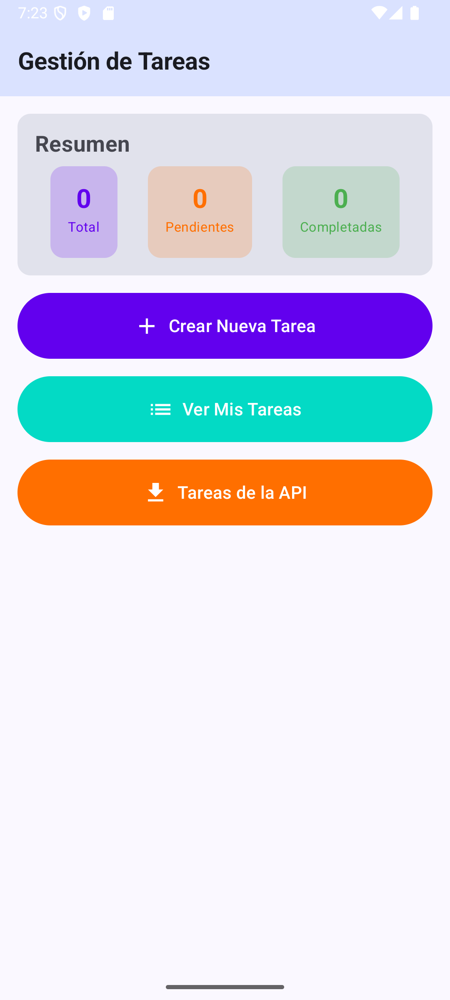

# Aplicación de Gestión de Tareas

## CONTENIDO:
Este proyecto consiste en una aplicación Android completa desarrollada en Kotlin con Jetpack Compose, que permite crear, visualizar, editar y eliminar tareas personales con prioridades y fechas límite. La aplicación utiliza una base de datos local SQLite para persistencia de datos y consume una API REST externa (JSONPlaceholder) para importar tareas de ejemplo. Su objetivo es demostrar el manejo completo de operaciones CRUD, navegación entre pantallas, validaciones de formularios, consumo de API REST y la integración de UI declarativa con lógica de base de datos.

---

## PANTALLA INICIAL: HOME

Al abrir la aplicación, el usuario encuentra la pantalla principal (Home) que incluye:

### **Resumen Estadístico:**
- **Total de tareas** registradas
- **Tareas pendientes** (sin completar)
- **Tareas completadas** (finalizadas)

### **Botones de Navegación Principales:**
1. **"Crear Nueva Tarea"** (púrpura) - Inicia el proceso de creación en 2 pasos
2. **"Ver Mis Tareas"** (turquesa) - Muestra todas las tareas con filtros
3. **"Tareas de la API"** (naranja) - Consume y muestra tareas desde JSONPlaceholder

<p align="center">
  
</p>


---

## CREACIÓN DE TAREAS - PROCESO EN 2 PASOS

### **PASO 1: Información Básica**
La primera pantalla de creación incluye:
- **Campo Título*** (obligatorio con validación en tiempo real)
- **Campo Descripción*** (obligatorio, multilinea)
- **Selector de Prioridad*** (3 opciones visuales con colores):
  - 🔴 **Alta** (rojo)
  - 🟠 **Media** (naranja)
  - 🟢 **Baja** (verde)
- Botón **"Siguiente"** para continuar al paso 2

**Validaciones implementadas:**
- Los campos no pueden estar vacíos
- Mensajes de error en tiempo real debajo de cada campo
- Toast de advertencia si se intenta avanzar sin completar

![Paso 1 - Formulario con validaciones]

### **PASO 2: Fecha Límite**
La segunda pantalla incluye:
- **Resumen** de los datos ingresados en el paso 1
- **DatePicker** para seleccionar fecha límite
- **Validación de fecha**: No permite fechas anteriores al día actual
- Botón **"Guardar Tarea"** (verde) para finalizar

**Funcionalidad del DatePicker:**
- Muestra diálogo con opciones de fecha
- Botón "Hoy" para seleccionar fecha actual
- Botón "+7 días" para una semana adelante
- Formato de fecha: DD/MM/YYYY

![Paso 2 - Selección de fecha con validación]

---

## VISUALIZACIÓN: MIS TAREAS

Esta pantalla muestra todas las tareas almacenadas localmente e incluye:

### **Barra Superior:**
- Botón de retroceso para volver al Home
- Icono de filtros para mostrar/ocultar opciones

### **Sistema de Filtros Avanzados:**

**Por Estado:**
- 📋 **Todos** - Muestra todas las tareas
- ⏳ **Pendientes** - Solo tareas sin completar
- ✅ **Completadas** - Solo tareas finalizadas

**Por Prioridad:**
- 🔴 **Alta** - Tareas urgentes
- 🟠 **Media** - Tareas normales
- 🟢 **Baja** - Tareas de baja prioridad
- **Todas** - Sin filtro de prioridad

### **Tarjetas de Tareas:**
Cada tarea se muestra en una card con:
- **Indicador circular de color** según prioridad
- **Título** (tachado si está completada)
- **Descripción** breve
- **Badge de prioridad** con color correspondiente
- **Fecha límite** con icono de calendario 📅
- **Botones de acción:**
  - ✅ **Toggle completado** (círculo vacío/check verde)
  - ✏️ **Editar** - Abre pantalla de edición
  - 🗑️ **Eliminar** (rojo) - Elimina la tarea

### **Botón Flotante (FAB):**
- Botón circular "+" en la esquina inferior derecha
- Acceso rápido para crear nueva tarea

![Lista de tareas con filtros activos y tarjetas]

---

## 🔄 FUNCIONAMIENTO DE BOTONES DE ACCIÓN

### **Ejemplo de Flujo Completo:**

#### 1️⃣ **EDITAR TAREA:**
Al presionar el botón **"Edit" ✏️** en cualquier tarea:
- Se abre la pantalla de edición
- Todos los campos se llenan automáticamente con los datos actuales
- El usuario puede modificar:
  - Título
  - Descripción
  - Prioridad (cambiando entre alta/media/baja)
  - Fecha límite
- Dos botones al final:
  - **"Cancelar"** - Descarta cambios y vuelve
  - **"Guardar"** - Actualiza la tarea en la base de datos

**Ejemplo:**
```
Tarea Original:
- Título: "Estudiar Kotlin"
- Prioridad: Media
- Fecha: 05/11/2025

Después de Editar:
- Título: "Estudiar Kotlin Avanzado"
- Prioridad: Alta
- Fecha: 03/11/2025
```

![Pantalla de edición con campos pre-llenados]

#### 2️⃣ **TOGGLE COMPLETADO:**
Al presionar el **círculo de estado** (⭕/✅):
- La tarea cambia inmediatamente de estado
- Si está pendiente → pasa a completada (aparece check verde ✅)
- Si está completada → vuelve a pendiente (círculo vacío)
- El título se tacha cuando está completada
- El fondo de la card cambia a gris claro

#### 3️⃣ **ELIMINAR TAREA:**
Al presionar el botón **"Delete" 🗑️** (rojo):
- La tarea se elimina permanentemente de la base de datos
- Aparece Toast confirmando: "Tarea eliminada"
- La lista se actualiza automáticamente
- No hay confirmación adicional (eliminación directa)

![Antes y después de eliminar tarea]

---

## 🌐 CONSUMO DE API REST: JSONPlaceholder

### **Funcionalidades de la Pantalla API:**

**Estados Manejados:**
1. **Cargando:**
   - Muestra CircularProgressIndicator
   - Texto: "Cargando tareas desde la API..."

2. **✅ Éxito:**
   - Card informativa con datos de la API
   - Lista de hasta 20 tareas de ejemplo
   - Cada tarea muestra:
     - Estado (completada ✅ o pendiente ⭕)
     - Título de la tarea
     - ID y Usuario
     - Botón **"Agregar"** para importar a base local

3. **❌ Error:**
   - Icono de advertencia rojo ⚠️
   - Mensaje descriptivo del error
   - Botón **"Reintentar"** para volver a intentar la conexión

### **Importación de Tareas:**
Al presionar **"Agregar"** en una tarea de la API:
- Se crea una nueva tarea local con:
  - Título de la API
  - Descripción: "Tarea importada desde JSONPlaceholder API (ID: X)"
  - Prioridad: Media (por defecto)
  - Fecha límite: +7 días desde hoy
  - Estado: Según el estado de la API
- Toast de confirmación: "Tarea agregada a Mis Tareas"
- La tarea queda guardada en SQLite

### **Botón de Actualización:**
- Icono de recarga en la barra superior
- Vuelve a hacer la petición HTTP
- Toast de confirmación al actualizar

![Pantalla API con estados: cargando, error y éxito]

---

##  ESTRUCTURA DEL PROYECTO

### **Archivos Principales:**

#### ** MainActivity.kt**
Contiene toda la lógica de la aplicación:
- **MainActivity**: Actividad principal que inicializa la base de datos
- **NavigationGraph()**: Define todas las rutas de navegación
- **Pantallas Composables:**
  - `HomeScreen()` - Pantalla principal con resumen
  - `CreateTaskStep1Screen()` - Primer paso de creación
  - `CreateTaskStep2Screen()` - Segundo paso con fecha
  - `MyTasksScreen()` - Lista de tareas con filtros
  - `EditTaskScreen()` - Edición de tareas existentes
  - `ApiTasksScreen()` - Consumo de API REST

#### **TaskDatabaseHelper.kt** (clase dentro de MainActivity.kt)
Administra la creación y operaciones de la base de datos SQLite:
- **onCreate()**: Crea la tabla `tasks` con todos los campos
- **onUpgrade()**: Maneja actualizaciones de versión
- **Operaciones CRUD:**
  - `insertTask()` - CREATE: Agrega nueva tarea
  - `getAllTasks()` - READ: Obtiene todas las tareas
  - `updateTask()` - UPDATE: Actualiza tarea existente
  - `deleteTask()` - DELETE: Elimina tarea por ID
  - `toggleTaskCompletion()` - Toggle estado completado

**Estructura de la tabla `tasks`:**
```sql
CREATE TABLE tasks (
    id INTEGER PRIMARY KEY AUTOINCREMENT,
    title TEXT NOT NULL,
    description TEXT NOT NULL,
    priority TEXT NOT NULL,
    due_date TEXT NOT NULL,
    is_completed INTEGER DEFAULT 0
)
```

#### ** Task (Data Class)**
Modelo de datos para representar una tarea:
```kotlin
data class Task(
    val id: Int = 0,
    val title: String,
    val description: String,
    val priority: String, // "alta", "media", "baja"
    val dueDate: String,   // Formato: DD/MM/YYYY
    val isCompleted: Boolean = false
)
```

#### **ApiTask (Data Class)**
Modelo para deserializar datos de JSONPlaceholder:
```kotlin
data class ApiTask(
    val userId: Int,
    val id: Int,
    val title: String,
    val completed: Boolean
)
```

#### ** ui/theme/**
Archivos de tema y estilo:
- **Theme.kt**: Define `MyAppCitasTheme` con colores claros/oscuros
- **Color.kt**: Paleta de colores del proyecto
- **Type.kt**: Tipografía y estilos de texto

### **Componentes Reutilizables:**

#### ** TaskCard()**
Componente para mostrar cada tarea en la lista:
- Recibe `task` y funciones callback para acciones
- Maneja visualización según estado (completada/pendiente)
- Aplica colores según prioridad
- Botones de acción integrados

#### ** ApiTaskCard()**
Similar a TaskCard pero para tareas de la API:
- Diseño adaptado para datos externos
- Botón de importación incluido
- Fondo verde claro para tareas completadas

#### **StatCard()**
Tarjeta pequeña para mostrar estadísticas en el Home:
- Muestra número y etiqueta
- Color personalizable
- Diseño compacto

#### ** PriorityButton()**
Botón de selección de prioridad:
- Tres estados: alta/media/baja
- Cambia de color según selección
- Distribuido equitativamente en Row

#### ** DatePickerDialog()**
Diálogo simulado para selección de fechas:
- Botón "Hoy" para fecha actual
- Botón "+7 días" para semana siguiente
- Validación integrada de fechas pasadas

---

## FUNCIONES AUXILIARES

### **fetchTasksFromApi()**
Función suspendida para consumir la API REST:
```kotlin
suspend fun fetchTasksFromApi(): List<ApiTask>
```
- Hace petición HTTP a `jsonplaceholder.typicode.com/todos`
- Timeout de conexión: 10 segundos
- Parsea JSON usando `JSONArray`
- Maneja excepciones de red
- Retorna lista de `ApiTask`

---

## VALIDACIONES IMPLEMENTADAS

### **Validaciones de Formulario:**
1. ✅ Título no vacío (mínimo 1 carácter)
2. ✅ Descripción no vacía
3. ✅ Prioridad seleccionada (obligatoria)
4. ✅ Fecha límite seleccionada
5. ✅ Fecha no anterior al día actual

### **Validaciones de Base de Datos:**
- ✅ Control de errores en operaciones INSERT/UPDATE/DELETE
- ✅ Verificación de resultado de operaciones
- ✅ Cierre automático de conexiones

### **Validaciones de Red:**
- ✅ Timeout de conexión (10 segundos)
- ✅ Manejo de excepciones HTTP
- ✅ Parseo seguro de JSON
- ✅ Estados de UI para loading/error/success

---

## NAVEGACIÓN ENTRE PANTALLAS

### **Rutas Definidas:**
```kotlin
"home" → Pantalla principal
"create_step1" → Paso 1 de creación
"create_step2/{title}/{description}/{priority}" → Paso 2 con parámetros
"my_tasks" → Lista de tareas
"edit_task/{taskId}" → Edición con ID
"api_tasks" → Consumo de API
```

### **Flujo de Navegación:**
```
Home
├── Create Step 1 → Create Step 2 → (Guarda y vuelve a Home)
├── My Tasks
│   ├── Edit Task → (Guarda y vuelve)
│   └── FAB → Create Step 1
└── API Tasks → (Puede agregar a My Tasks)
```

---

## DISEÑO

### **Paleta de Colores:**
- **Primario**: Púrpura (#6200EE)
- **Secundario**: Turquesa (#03DAC5)
- **Terciario**: Naranja (#FF6F00)
- **Éxito**: Verde (#4CAF50)
- **Error**: Rojo (#E53935)

### **Prioridades con Colores:**
- 🔴 Alta: Rojo (#E53935)
- 🟠 Media: Naranja (#FB8C00)
- 🟢 Baja: Verde (#43A047)

### **Estados Visuales:**
- Tareas completadas: Texto tachado + fondo gris claro
- Tareas pendientes: Texto normal + fondo blanco
- Cargando: Indicador circular animado
- Error: Icono de advertencia + texto rojo

### **Feedback al Usuario:**
- Toast para confirmaciones de acciones
- Validaciones en tiempo real en formularios
- Cambios inmediatos en la UI tras operaciones
- Estados de carga claros

---

## TECNOLOGÍAS UTILIZADAS

- **Lenguaje**: Kotlin
- **UI Framework**: Jetpack Compose
- **Base de Datos**: SQLite (SQLiteOpenHelper)
- **Navegación**: Navigation Compose
- **Networking**: HttpURLConnection (Java estándar)
- **Parsing JSON**: org.json (Android built-in)
- **Manejo de Estado**: Compose State (remember, mutableStateOf)
- **Coroutines**: Kotlin Coroutines para operaciones asíncronas

---

## DEPENDENCIAS GRADLE

```kotlin
implementation("androidx.navigation:navigation-compose:2.7.5")
implementation("androidx.compose.material:material-icons-extended:1.5.4")
implementation("androidx.lifecycle:lifecycle-runtime-ktx:2.6.2")
implementation("androidx.activity:activity-compose:1.8.1")
```

---

## PERMISOS ANDROID

```xml
<uses-permission android:name="android.permission.INTERNET" />
```

---

## CAPTURAS DE PANTALLA

### 1. Pantalla Home
[Insertar captura del Home con resumen y botones]

### 2. Crear Tarea - Paso 1
[Insertar captura del formulario paso 1]

### 3. Crear Tarea - Paso 2
[Insertar captura del DatePicker]

### 4. Lista de Tareas con Filtros
[Insertar captura de la lista completa]

### 5. Editar Tarea
[Insertar captura de la pantalla de edición]

### 6. API - Estado de Carga
[Insertar captura del loading]

### 7. API - Lista de Tareas
[Insertar captura de tareas de la API]

### 8. API - Estado de Error
[Insertar captura del error de conexión]

---

## CONCLUSIÓN

Este proyecto permitió comprender y aplicar conceptos avanzados de desarrollo Android moderno:

✅ **Persistencia de datos** con SQLite y operaciones CRUD completas  
✅ **Consumo de API REST** con manejo de estados y errores  
✅ **Navegación multi-pantalla** con paso de parámetros  
✅ **Validaciones robustas** en formularios y datos  
✅ **UI declarativa** con Jetpack Compose  
✅ **Arquitectura escalable** con separación de responsabilidades  
✅ **Programación asíncrona** con Coroutines  
✅ **Manejo de estado reactivo** con Compose State  

---

## AUTOR

Yesid Castro  
[https://github.com/yezid-jr/]
Fecha: Octubre 2025

---

## 📄 LICENCIA

[Especificar licencia si aplica]
